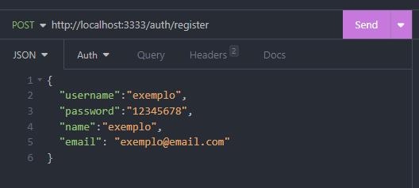
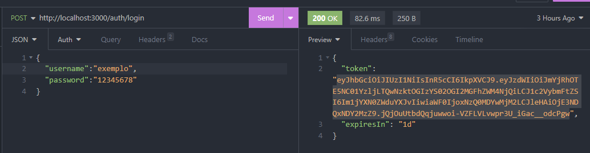

# 📦 Backend - NestJS API

Este é o projeto de backend da aplicação, desenvolvido com [NestJS](https://nestjs.com/). Ele fornece as rotas e lógica de negócio da API RESTful.

## 🚀 Tecnologias

- Node.js
- NestJS
- TypeScript
- Prisma ORM
- PostgreSQL

## ✅ Pré-requisitos

- Node.js 18+
- PostgreSQL
- Npm

## 📦 Como rodar esta API

1. Na raiz desta pasta rode `npm install` e instale as dependências.
2. Configure o .env, existe um `.env.exemple` com as variaveis necessárias.
3. Suba as imagens do banco Postgres e do SGBD Adminer usando o comando `docker-compose up -d`.
4. Rode as migrações com `npm run migration:run` para criar as tabelas e configurações necessárias no banco de dados.
5. Por ultimo, execute sua aplicação usando o comando `npm run start:dev`.

## Funcionalidades da API

✅ Autenticação

- POST /auth/register: Cadastra um novo usuário.
  []
- POST /auth/login: Autentica um usuário e retorna um token JWT.

📋 Tarefas

- GET /tasks: Lista todas as tarefas do usuário autenticado.
- POST /tasks: Cria uma nova tarefa.
- PATCH /tasks/:id: Atualiza dados da tarefa.
- DELETE /tasks/:id: Remove uma tarefa.

🔁 Controle de Conclusão

- PATCH /tasks/:id/complete: Marca a tarefa como concluída.

📌 Status da Tarefa

A tarefa pode conter campos como:

- title: título
- description: descrição (opcional)
- status: status da tarefa

# Screenshots

Registro

Login

